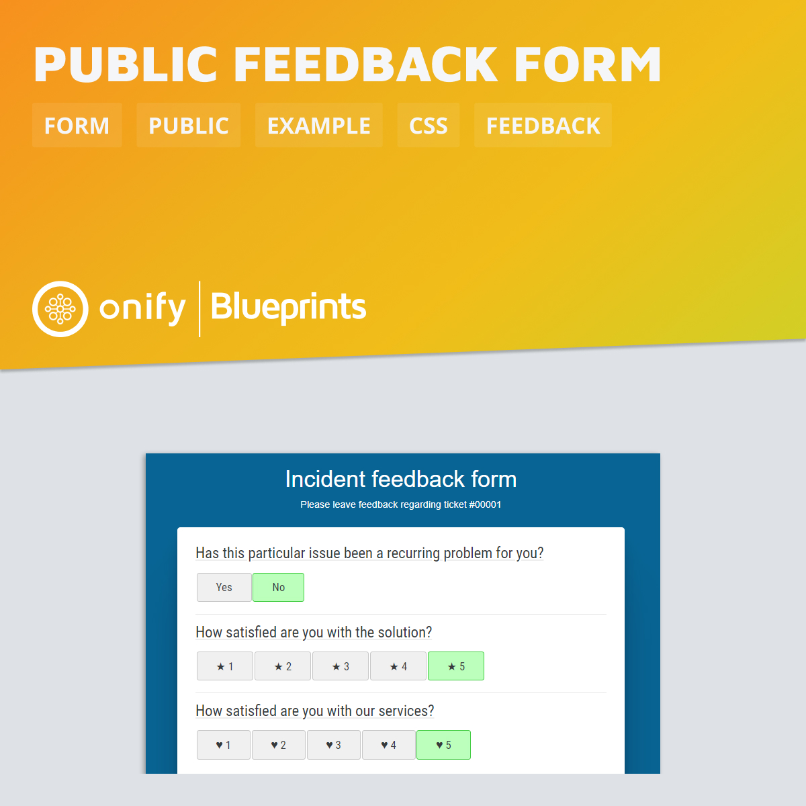

# Onify Blueprint: Public feedback form

Here is a quick example how to create a simple public form with custom css. All you need to do is connect the form to a task/process that adds the data somewhere :-)

## Requirements

* Onify Hub v2

## Included

* 1 x Form
* 1 x CSS file

## Setup

1. Copy `.\resources\*` to your Onify Hub resources
2. Add form config (`feedback_form.json`) via API (`POST /api/v2/admin/forms`) 

## Run 

* Open `/form/feedback` and follow the instructions :-)
* If you want, we also support sending the ticketid like this: `/form/feedback?ticketid=99999`.

## Support

* Community/forum: https://support.onify.co/discuss
* Documentation: https://support.onify.co/docs
* Support and SLA: https://support.onify.co/docs/get-support

## License

This project is licensed under the MIT License - see the [LICENSE](LICENSE) file for details.

## Contributors

Thanks [Patrik Öhrn](https://github.com/xpatohr) @ [Zitac](https://github.com/zitacconsulting) for great work.

